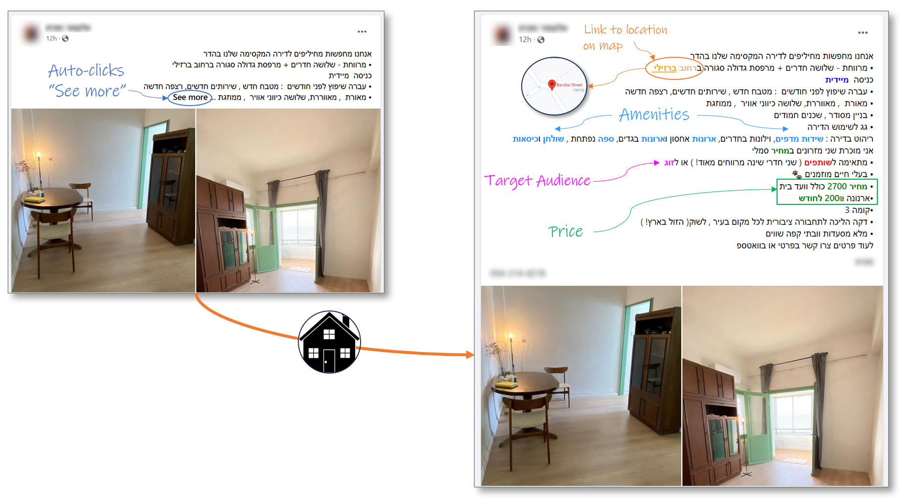
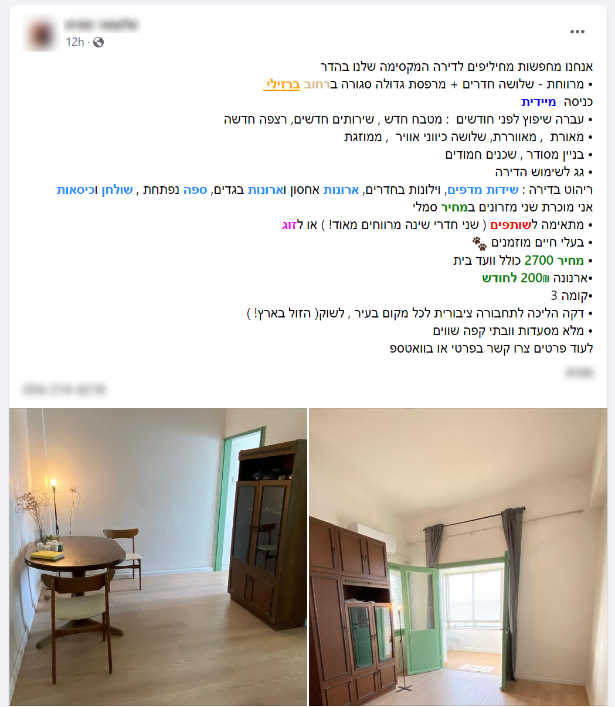
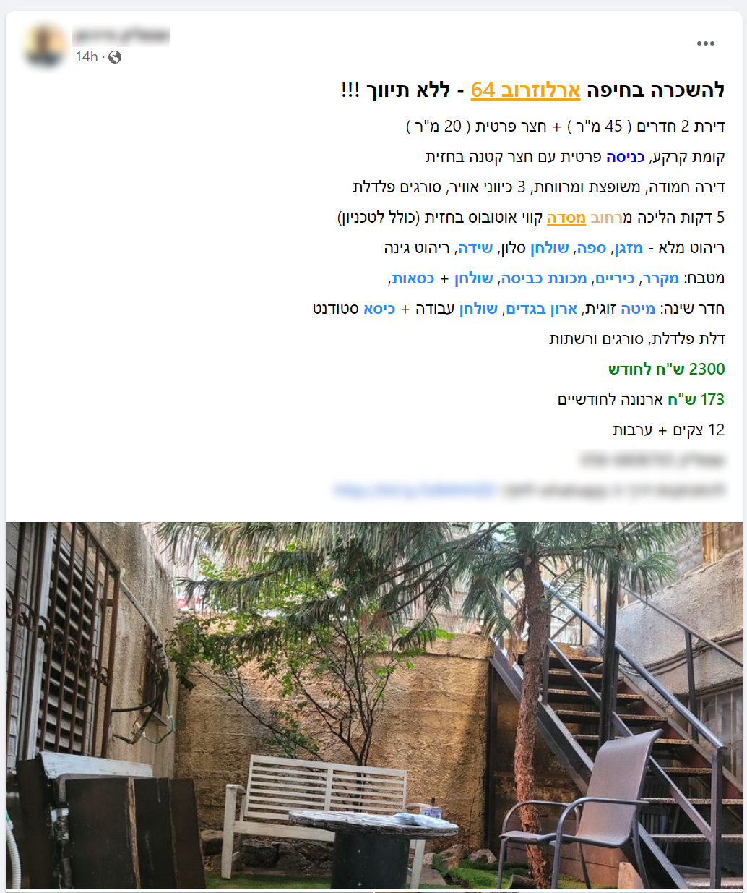
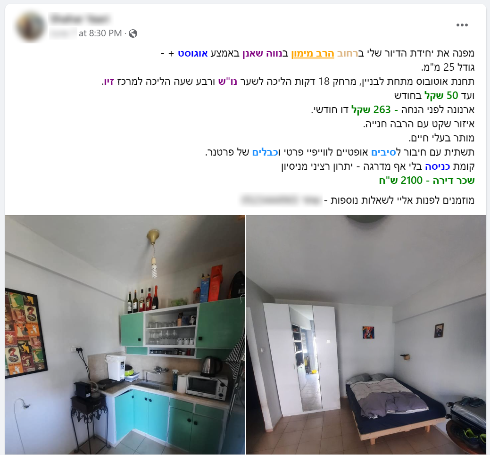
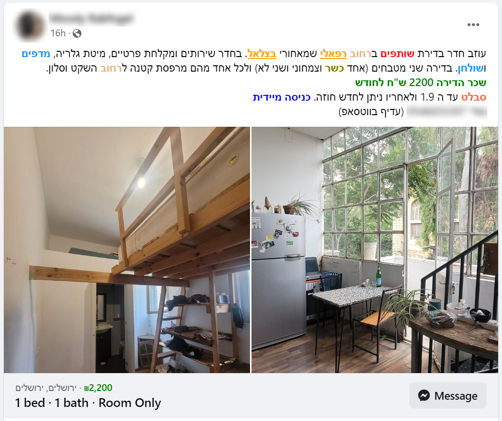

# Home Finder Extension

"Home Finder" is a browser extension that enhances Facebook group posts for apartment rentals by adding metadata to them.  
When browsing selected Facebook groups dedicated to apartments for rent, this browser extension parses each post, identifies
significant keywords and highlights them in a way that makes them easy to spot. This allows users to quickly evaluate the post
and decide whether it's relevant or not.

## Features

 * Auto clicks the "See more" link for easy continuous scrolling
 * Identifies street names and enhances them with a link to Google Maps
 * Identifies and highlights:
    * Prices
    * Street names
    * Neighborhood names
    * Amenities / Furniture 
    * Entry dates
    * Religious restrictions
    * Target audience (couple / roommates)

Supports selected groups for the following cities:

 * Jerusalem
 * Tel Aviv
 * Haifa
 * Be'er Sheva
 * Modi'in

## Background

This browser extension is based on a side project that I developed some years ago: The [Home Finder](https://github.com/Dvd848/home_finder) website.  
As a website, this service had the ability to aggregate posts from different groups, hide duplicate posts and much more. However, at some point
Facebook blocked the API access to group posts and made it much harder to reacquire access.  
The browser extension is limited in its abilities compared to the website, but can still offer some of the basic functionality which was available through the website.

Most of the core logic is copied as-is from the original website and probably requires a rewrite according to modern standards. 

## Screenshots

The following are real-world examples of posts enhanced by the browser extension:

